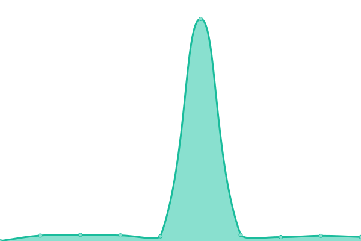

# 

This repository contains the open-source uptime monitor and status page for [Cyscale - Cloud Security](https://cyscale.com), powered by [Upptime](https://github.com/upptime/upptime).

With [Upptime](https://upptime.js.org), you can get your own unlimited and free uptime monitor and status page, powered entirely by a GitHub repository. We use [Issues](https://github.com/cyscale/status.cyscale.com/issues) as incident reports, [Actions](https://github.com/cyscale/status.cyscale.com/actions) as uptime monitors, and [Pages](https://status.cyscale.com) for the status page.

<!--start: status pages-->
<!-- This summary is generated by Upptime (https://github.com/upptime/upptime) -->
<!-- Do not edit this manually, your changes will be overwritten -->
<!-- prettier-ignore -->
| URL | Status | History | Response Time | Uptime |
| --- | ------ | ------- | ------------- | ------ |
|  [Cyscale Website](https://cyscale.com) | 🟩 Up | [cyscale-website.yml](https://github.com/cyscale/status.cyscale.com/commits/HEAD/history/cyscale-website.yml) | 

 106ms
     
 | 

<a href="https://status.cyscale.com/history/cyscale-website">100.00%</a>
    

|  [Power Cloud Platform](https://app.cyscale.com) | 🟩 Up | [power-cloud-platform.yml](https://github.com/cyscale/status.cyscale.com/commits/HEAD/history/power-cloud-platform.yml) | 

 177ms
     
 | 

<a href="https://status.cyscale.com/history/power-cloud-platform">100.00%</a>
    

|  [Cyscale API](https://api.cyscale.com) | 🟥 Down | [cyscale-api.yml](https://github.com/cyscale/status.cyscale.com/commits/HEAD/history/cyscale-api.yml) | 

 153ms
     
 | 

<a href="https://status.cyscale.com/history/cyscale-api">11.63%</a>
    

|  [GraphQL API](https://graphql.cyscale.com) | 🟥 Down | [graph-ql-api.yml](https://github.com/cyscale/status.cyscale.com/commits/HEAD/history/graph-ql-api.yml) | 

 158ms
     
 | 

<a href="https://status.cyscale.com/history/graph-ql-api">17.92%</a>
    

|  [Authentication API](https://graphql.cyscale.com) | 🟥 Down | [authentication-api.yml](https://github.com/cyscale/status.cyscale.com/commits/HEAD/history/authentication-api.yml) | 

 98ms
     
 | 

<a href="https://status.cyscale.com/history/authentication-api">9.76%</a>
    

<!--end: status pages-->

[**Visit Cyscale's Status page →**](https://status.cyscale.com)

## 📄 License

- Powered by: [Upptime](https://github.com/upptime/upptime)
- Code: [MIT](./LICENSE) © [Cyscale](http://cyscale.com)
- Data in the `./history` directory: [Open Database License](https://opendatacommons.org/licenses/odbl/1-0/)
